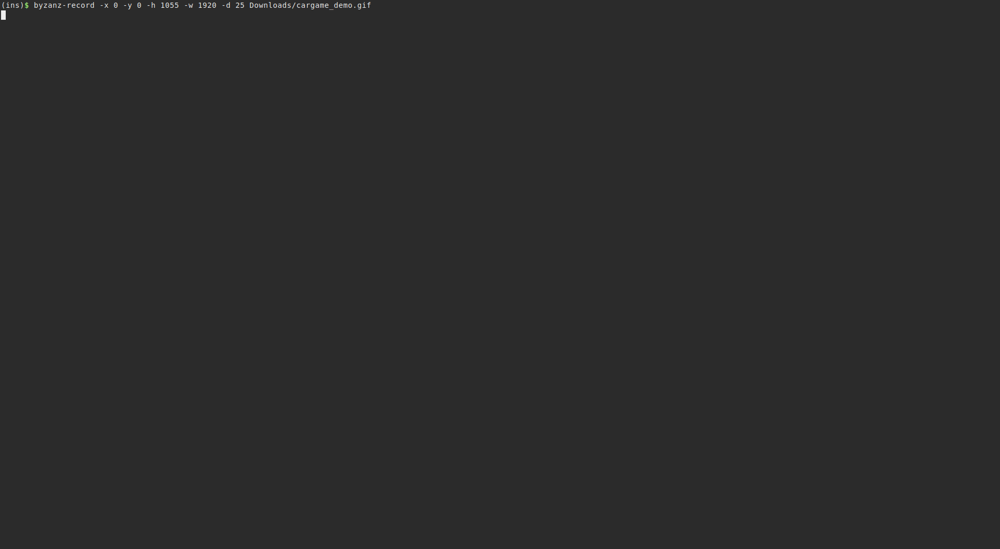

cargame - a simple curses car game
==================================
Some time ago, I wrote this little game for my sister, but then I devloped it
further in order to play with wide characters and ncurses... :-)

CAUTION: As I played a bit around recently, it is still a bit buggy.
So really "work-in-progress" at the moment. ;-)

Project Status
--------------
I wrote this software some time ago in order to learn something new and 
in order to use it and to play with it. However, I am no longer satisfied
with the current state of the project. That's why it is now archived for the
time being. :)

Dependencies:
-------------
Build dependendencies are:
on Debian 9: `libncurses5-dev` and `libncursesw5-dev`
on Debian 10: `libncurses-dev`

Runtime dependendencies are:
on Debian 9: `libncurses5` and `libncursesw5`
on Debian 10: `libncurses6` and `libncursesw6`

Coding style:
-------------
My coding style is very similar to the suggestions of the "suckless" community
(https://suckless.org/coding_style/ and https://suckless.org/philosophy/) and
the Linux kernel (https://www.kernel.org/doc/Documentation/process/coding-style.rst).
### valgrind
valgrind shows some "still reachable" pointers after terminating.
These are (should be) only those belonging to the ncurses library. Please
refer to https://invisible-island.net/ncurses/ncurses.faq.html#config_leaks
for further information on the "memory leaks" of this library.

Usage
-----
You need a level file, which can be loaded as game field (cf. "example_level_file").
Then you need to navigate with your car to the parking place without crashing
something.
The default representation of the car is an arrow which points to the current
driving direction of the car.
If you selected the game borders, you may not crash them either. If not,
you may leave the screen on the one side and you will enter the screen on the
other (like the old snake games :-) ).
See manpage for available shortcuts.

Help output (option `-h`):
--------------------------
```
usage: cargame [OPTION]... LEVELFILE
   or: cargame OPTION

options available:
    -b      toggle use of game borders
    -c      print car characters
    -h      show this help
    -s      show maximum level size
    -v      show version information

See manpage for additional usage information.
```

Demo Gif
--------

